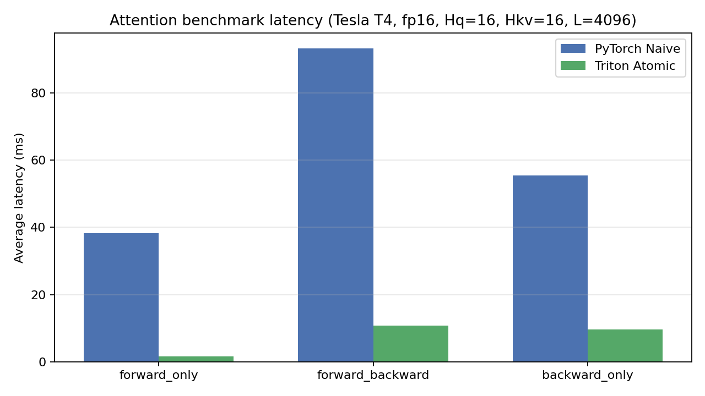
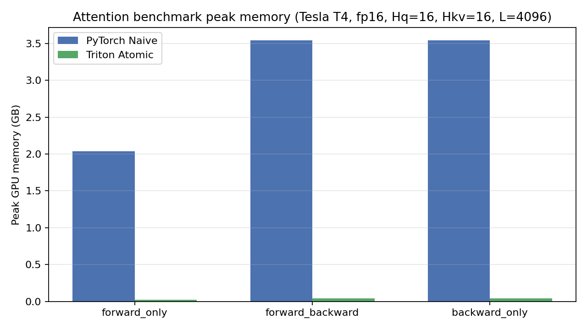
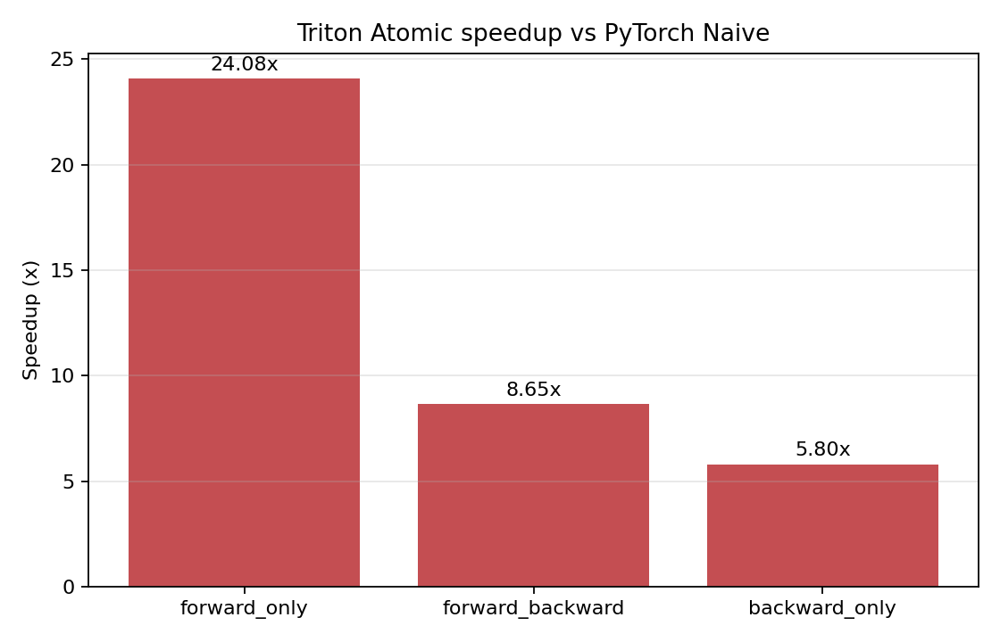

# FlashAttention backward pass for GPT-OSS fine-tuning in Triton

This project implements a custom Triton kernel for FlashAttention-2 forward and backward passes, incorporating modern techniques such as grouped query attention (GQA), sliding window attention (SWA), and attention sinks. My original goal was to use this for finetuning OpenAI's open-weight model GPT-OSS, which was missing FlashAttention backward pass. We benchmark the speed-up and peak memory usage (for attention only, not end-to-end finetuning) against a naive PyTorch implementation (also with GQA/SWA/attention sinks).

## What the Benchmark Compares

### PyTorch Naive baseline

Explicit dense attention:

1. Repeat K/V for GQA if needed
2. Form full score tensor `S = QK^T / sqrt(D)`
3. Apply causal + sliding-window + sink mask
4. Softmax → `P @ V`
5. Backward via PyTorch autograd

This materializes an `[B, Hq, L, L]` attention matrix and dominates memory.

### Triton Atomic

Custom `torch.autograd.Function` with:

- Tiled forward kernel (sparse sink + window key blocks)
- Tiled backward kernel with atomic accumulation for `dK` / `dV`
- No dense `[L, L]` attention matrix

## Results

Benchmark config: `B=1`, `Hq=16`, `Hkv=16`, `L=4096`, `D=16`, `W=256`, `S=4`, `dtype=torch.float16`

### forward_only

| Implementation | Avg ms | Peak GB |
|---|---:|---:|
| PyTorch Naive | 38.2578 | 2.0374 |
| Triton Atomic | 1.3437 | 0.0239 |

**Speedup:** 28.47x · **Memory saving:** 85.15x

### forward_backward

| Implementation | Avg ms | Peak GB |
|---|---:|---:|
| PyTorch Naive | 93.2606 | 3.5432 |
| Triton Atomic | 4.0357 | 0.0435 |

**Speedup:** 23.11x · **Memory saving:** 81.53x

### backward_only

| Implementation | Avg ms | Peak GB |
|---|---:|---:|
| PyTorch Naive | 55.3403 | 3.5432 |
| Triton Atomic | 3.1075 | 0.0435 |

**Speedup:** 17.81x · **Memory saving:** 81.53x

## Benchmark Plots

