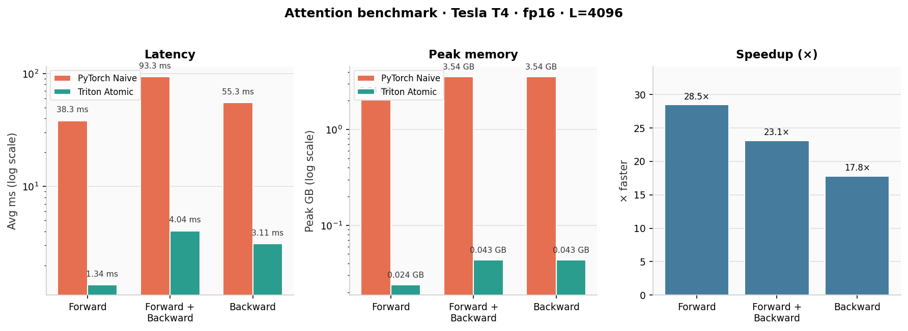

# FlashAttention backward pass for GPT-OSS fine-tuning in Triton

This project implements a custom Triton kernel for FlashAttention-2 forward and backward passes, incorporating modern techniques such as grouped query attention (GQA), sliding window attention (SWA), and attention sinks. My original goal was to use this for finetuning OpenAI's open-weight model GPT-OSS when it was released, which was missing FlashAttention backward pass. We benchmark the speed-up and peak memory usage (for attention only, not end-to-end finetuning) against a naive PyTorch implementation (also with GQA/SWA/attention sinks).

## What the Benchmark Compares

### PyTorch Naive baseline

This is a straightforward PyTorch implementation that computes attention the textbook way: build the full query–key score matrix, apply the mask, softmax, then multiply by values. Gradients come from PyTorch autograd.

1. **GQA:** If there are fewer key/value heads than query heads, copy K/V so every query head has a match.
2. **Scores:** For every token pair, compute `score = Q·K / √D` → an `L×L` matrix per head.
3. **Mask:** Zero out disallowed pairs (future tokens, keys outside the sliding window, except always-allowed sink tokens).
4. **Output:** Softmax the scores, then multiply by V.
5. **Backward:** Standard autograd through all of the above.

**Why it's expensive:** Even with masking, PyTorch still allocates a dense `[B, Hq, L, L]` score tensor. At `L=4096`, that tensor alone is ~2 GB, most of which is wasted on pairs the mask will discard.

### Triton Atomic

Attention implemented similarly to above, now using Triton.

Implements a custom replacement for `torch.autograd.Function` with:

- **Forward:** Tiled kernel (sparse sink + window key blocks)
- **Backward:** Tiled kernel with atomic accumulation for `dK` / `dV`
- **Memory:** No dense `[L, L]` attention matrix

**Why it's faster:** Never materializes the full `L×L` score matrix, and only computes the window + sinks each token actually uses.

## Results

**Benchmark config:** `B=1`, `Hq=16`, `Hkv=16`, `L=4096`, `D=16`, `W=256`, `S=4`, `dtype=torch.float16`

### Forward only

| Implementation | Avg ms | Peak GB |
|---|---:|---:|
| PyTorch Naive | 38.2578 | 2.0374 |
| Triton Atomic | 1.3437 | 0.0239 |

**Speedup:** 28.47x · **Memory saving:** 85.15x

### Forward + backward

| Implementation | Avg ms | Peak GB |
|---|---:|---:|
| PyTorch Naive | 93.2606 | 3.5432 |
| Triton Atomic | 4.0357 | 0.0435 |

**Speedup:** 23.11x · **Memory saving:** 81.53x

### Backward only

| Implementation | Avg ms | Peak GB |
|---|---:|---:|
| PyTorch Naive | 55.3403 | 3.5432 |
| Triton Atomic | 3.1075 | 0.0435 |

**Speedup:** 17.81x · **Memory saving:** 81.53x

## Benchmark Plots

  

